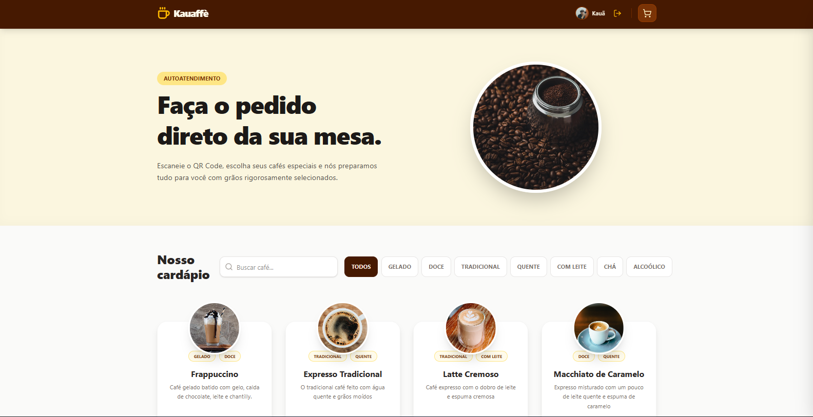

<h1 align="center">
  ☕<br>
  Kauaffè - Autoatendimento & E-commerce
</h1>

<p align="center">
  
  
  
  
  
</p>

> [!NOTE]
> O **Kauaffè** é um projeto focado na construção de um sistema prático e moderno de autoatendimento de mesa. O grande diferencial deste projeto foi a aplicação profunda de **Context API** para gerenciamento de estado global (Carrinho e Autenticação) interligada com um Banco de Dados real e em nuvem (**Firebase**).

<p align="center">
  
</p>

---

## 🎯 O Objetivo

Modernizar o fluxo de pedidos de uma cafeteria através de um cardápio digital (acessível via QR Code ou Totem). O cliente escolhe seus cafés, monta o pedido e o envia direto para a cozinha, informando apenas o número da sua mesa. O sistema conta ainda com um painel de retaguarda exclusivo, onde o administrador gerencia os pedidos e o estoque em tempo real.

---

## 🛠️ Tecnologias Utilizadas

- **Front-end:** React + TypeScript (componentização segura e escalável).
- **Estilização:** Tailwind CSS (interfaces modernas, flexíveis e responsivas).
- **Ferramenta de Build:** Vite (performance e agilidade no desenvolvimento).
- **Backend as a Service:** Firebase (Firestore para banco de dados e Firebase Auth para login com Google).
- **Roteamento:** React Router DOM (navegação rápida em Single Page Application).
- **Notificações:** React Hot Toast (feedbacks visuais amigáveis e não intrusivos).

---

## 🚀 Funcionalidades Principais

- **Carrinho Inteligente:** Gerenciado por Context API, salva os dados no `localStorage` (sobrevive a F5), com controle automático de limites baseados no estoque real.
- **Autenticação Segura e RBAC:** Login simplificado via Google. O sistema identifica os papéis dos usuários (Cliente vs. Admin) e renderiza interfaces e permissões diferentes.
- **Dashboard Administrativo:** O Admin possui uma visão exclusiva onde pode alterar o status dos pedidos ("Pendente", "A Caminho", "Entregue") e atualizar o estoque da loja rapidamente.
- **Estoque Dinâmico:** Se um café esgota no banco de dados, o cartão dele fica cinza e o botão de compra é desativado no front-end em tempo real.
- **Paginação e Filtros Responsivos:** Busca de produtos por nome ou categoria (Quente, Gelado, Doce), exibindo um número dinâmico de itens por tela de acordo com o dispositivo do usuário (Desktop ou Mobile).

---

## 📂 Estrutura do Projeto

```text
KAUAFFE/
├── src/
│   ├── components/   # Blocos visuais (Header, Footer, CoffeeCard, Cart)
│   ├── contexts/     # Lógica global e estados (AuthContext, CartContext)
│   ├── pages/        # Telas da aplicação (Home, Checkout, Profile)
│   ├── services/     # Configuração de dependências externas (firebase.ts)
│   ├── types/        # Contratos de dados TypeScript (Interfaces)
│   ├── App.tsx       # Rotas e provedores de contexto
│   └── main.tsx      # Ponto de entrada do React
└── package.json      # Dependências do projeto
```
